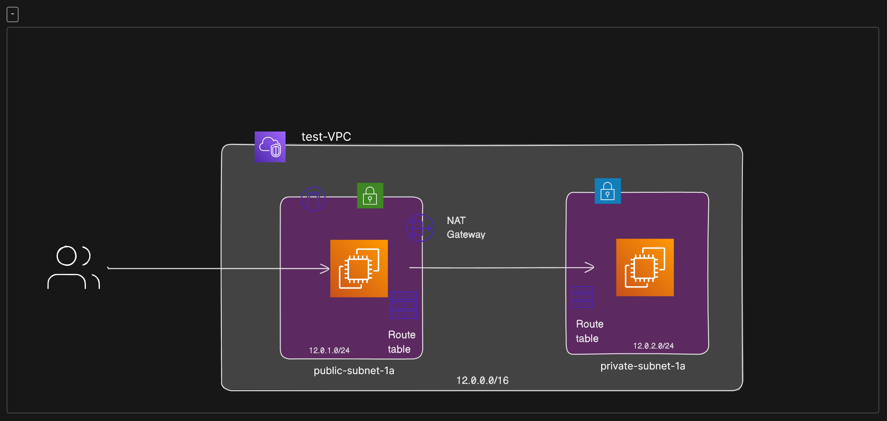
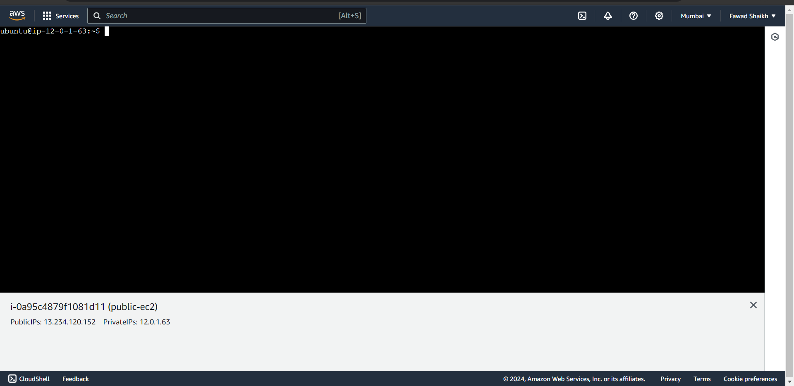
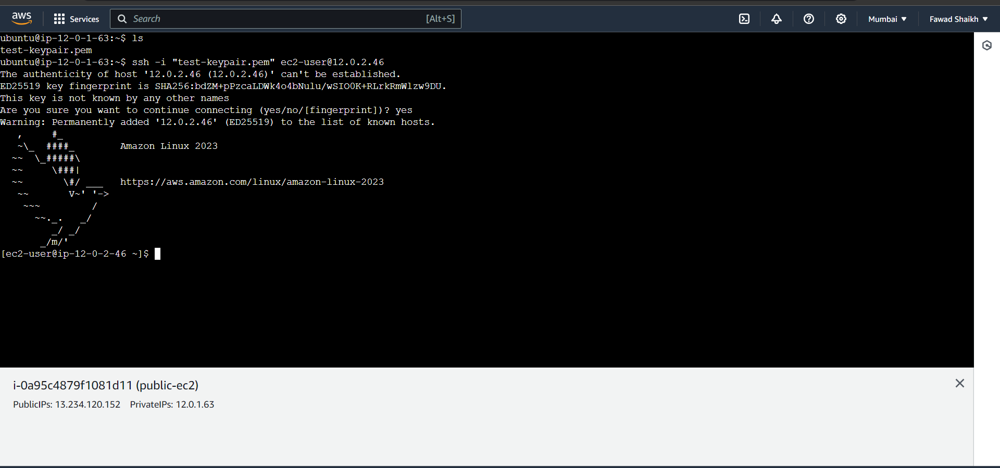

# AWS-VPC-with-NAT-Gateway-Demonstration

## Overview

This project illustrates the implementation of a Virtual Private Cloud (VPC) in AWS with a CIDR block of 12.0.0.0/16. The focus is on demonstrating the NAT Gateway service, which facilitates secure internet access for instances in the private subnet. The VPC includes an internet gateway, a public subnet (12.0.1.0/24), a private subnet (12.0.2.0/24), and two EC2 instances. A NAT Gateway is set up to enable private subnet instances to access the internet while maintaining security.

## About NAT Gateway
Service Type: Managed AWS service
Functionality:
- Enables instances in the private subnet to initiate outbound traffic to the internet.
- Provides a managed NAT service with high availability.
- Automatically scales based on demand.

## Architecture



*This is the Architecture that i will be using for this project*

## VPC Configuration

### VPC
- VPC Name: test
- IPv4 CIDR Block: 12.0.0.0/16
- Internet Gateway - test-igw

### Subnets

#### Public Subnet

- Subnet Name: public-subnet
- IPv4 CIDR Block: 12.0.1.0/24

#### Private Subnet

- Subnet Name: private-subnet
- IPv4 CIDR Block: 12.0.2.0/24

### Route Tables

#### Public Subnet Route Table

- Route Table Name: public-subnet-rt
- Associations: Associate with the public subnet
- Routes:
    - 0.0.0.0/0 to the internet gateway for internet access
#### Private Subnet Route Table
- Route Table Name: private-subnet-rt
- Associations: Associate with the private subnet
- Routes:
    - 0.0.0.0/0 to the NAT Gateway for internet access

## EC2 Instances

### Public Subnet Instance
- Instance Name: public-instance
- Instance Type: t2.micro
- Enable Public IP Address
- Security Groups: Allow SSH and HTTP

### Private Subnet Instance
- Instance Name: private-instance
- Instance Type: t2.micro
- Disable Public IP Address
- Security Groups: Allow SSH and HTTP

## NAT Gateway
- NAT Gateway Name: nat-gateway
- Associated Subnet: public-subnet
- Elastic IP: Automatically assigned


## Verification

1. SSH into each EC2 instance in VPC
   ```bash
   ssh -i [Your_Key_Pair.pem] ec2-user@[Instance_Public_IP]

2. Copy the key pair into the public instance and SSH into the private subnet instance.
3. Test internet access from the private subnet instance.


## Conclusion
This project highlights the significance of NAT Gateway in providing secure internet access to instances in the private subnet of a VPC. The service offers managed and scalable NAT capabilities, simplifying outbound traffic management.
